<div align="center">
  


</div>

<div align="center">
  
[](https://git.io/typing-svg)

</div>

<div align="center">

[](https://linkedin.com/in/kurrytran)
[](https://github.com/Kurry)
[](https://huggingface.co/kurry)
[](https://kurry.github.io)
[](mailto:kurry.tran@gmail.com)

</div>

---

<div align="center">

## 🎯 **Professional Overview**

</div>

### 💡 **About Me**

```typescript
interface KurryTran {
    // Core Expertise
    readonly roles: ["AI Engineer", "Quantitative Trader", "Systems Architect"];
    readonly experience: {
        total: "14+ years in software engineering",
        ai: "5+ years in production AI/ML",
        trading: "5+ years in quantitative finance"
    };
    
    // Professional Focus
    readonly specialties: [
        "Multi-Agent LLM Systems",
        "Financial AI/ML Pipelines",
        "High-Performance Trading Infrastructure",
        "On-Device ML & Security"
    ];
    
    // Achievements
    readonly metrics: {
        patents: "7 US Patents",
        trading: "$1M+ in Annual Arrival Slippage Reduction",
        automation: "38% faster incident response"
    };
    
    // Current Focus
    readonly currentMission: "Building autonomous AI systems that think and trade";
    readonly philosophy: "Bridging cutting-edge AI with institutional finance";
}
```

### 📊 **Key Metrics**

<div align="center" style="padding: 10px;">


</div>

### 🎯 **Current Focus**

```mermaid
graph TD
    A[🤖 Multi-Agent<br/>Systems] --> B[🧠 AI Decision<br/>Making]
    B --> C[📊 Financial<br/>Markets]
    C --> D[💰 Alpha<br/>Generation]
    D --> A
    
    style A fill:#1f77b4,stroke:#fff,stroke-width:2px,color:#fff
    style B fill:#ff7f0e,stroke:#fff,stroke-width:2px,color:#fff
    style C fill:#2ca02c,stroke:#fff,stroke-width:2px,color:#fff
    style D fill:#d62728,stroke:#fff,stroke-width:2px,color:#fff
```

<div align="center">



</div>

---

<div align="center">

# 🚀 **Technology Stack**

</div>

<div align="center">

### **🤖 AI & Machine Learning**

<div style="margin: 15px 0;">


</div>

### **💻 Programming & Data Engineering**

<div style="margin: 15px 0;">


</div>

### **☁️ Cloud & Infrastructure**

<div style="margin: 15px 0;">


</div>

### **📊 Financial & Trading Systems**

<div style="margin: 15px 0;">


</div>

</div>

---

<div align="center">

# 🎨 **Work Experience & Featured Projects**

</div>

<div align="center">

| 🚀 **Project** | 📖 **Description** | ⚡ **Tech Stack** | 🔗 **Links** |
|----------------|-------------------|-------------------|---------------|
| **Android CI/CD & Architecture**<br>*May 2025* | A comprehensive case study of a modern Android application's CI/CD pipeline and clean architecture implementation. Covers secure development practices, multi-environment support, and automated testing strategies. |    | [📂 Repo](https://github.com/Kurry/ci-architecture-site) • [🌠Case Study](https://kurry.github.io/ci-architecture-site/) |
| **Hedge Fund Analyst**<br>*May 2025* | Advanced analytics toolkit for hedge fund research, portfolio optimization, and risk management. |    | [📂 Repo](https://github.com/Kurry/hedge-fund-analyst) • [🌠Case Study](#) |
| **Earnings Call Analysis**<br>*May 2025* | NLP-powered sentiment analysis of earnings calls with predictive market impact modeling. |    | [📂 Repo](https://github.com/Kurry/earnings_call_tone_research) • [🌠Case Study](#) |
| **UNH Case Study**<br>*May 2025* | Comprehensive Python-based analytical framework and case study for UNH research project. |    | [📂 Repo](https://github.com/Kurry/unh-case-study) • [🌠Case Study](#) |

</div>

---

# 🔬 **AI Research & Datasets**

<div align="center">

[](https://huggingface.co/kurry)

### 📊 Featured Datasets

| Dataset | Description | Records | Time Period | Key Features |
|---------|-------------|---------|-------------|--------------|
| **[S&P 500 Earnings Transcripts](https://huggingface.co/datasets/kurry/sp500_earnings_transcripts)** | Complete transcripts of quarterly earnings calls | 33,000+ | 2005-2025 | Structured speaker segmentation, company metadata, temporal data |
| **[S&P 500 Tone Dataset](https://huggingface.co/datasets/kurry/sp500_tone_dataset)** | Tone dispersion metrics from S&P 500 earnings calls | 33,362 | 2005-2025 | Captures sentiment variability, useful for market prediction models |
| **[Institutional Holdings 13F](https://huggingface.co/datasets/kurry/institutional-holdings-13f-quarterly)** | Quarterly 13F filings from institutional investors | 179 quarters | 1980-2024 | Includes holdings data, investor embeddings, and asset embeddings |

### 📚 **Research Applications**
**Financial Analysis**: Extract insights from earnings calls and SEC filings • **Sentiment Tracking**: Monitor executive tone and market sentiment • **Institutional Research**: Analyze hedge fund positions and investment strategies • **Market Prediction**: Build models using alternative data sources

</div>

---

<div align="center">

### 🧬 **Patent Portfolio**

<div align="center" style="background: linear-gradient(135deg, rgba(255,215,0,0.1), rgba(255,165,0,0.1)); border-radius: 15px; padding: 30px; margin: 20px;">


**Innovation Areas:** Secure Systems • AI/ML • Fintech • Authentication • Blockchain • Document Authorization  
**Patent Assignee:** Capital One Services, LLC  
**Co-Inventors:** Zhe Liu, Jeremy J. Phillips, Kurry Lu Tran

</div>

<details>
<summary><b>📋 View Patent Details</b></summary>

<div align="center">

| 🏷️ **Patent ID** | 📋 **Title** | 📅 **Date** | 🔗 **Link** |
|------------------|--------------|-------------|-------------|
| US-2021201259-A1 | Intelligence platform for scheduling product preparation and delivery | 2021-07-01 | [🔍 View](https://patents.google.com/patent/US20210201259A1/en) |
| US-11636541-B2 | Secure system | 2023-04-25 | [🔍 View](https://patents.google.com/patent/US11636541B2/en) |
| US-12182816-B2 | Transaction confirmation and authentication based on device sensor data | 2024-12-31 | [🔍 View](https://patents.google.com/patent/US12182816B2/en) |
| US-2024394675-A1 | Aggregation of ATM device-related information and/or factor-based selection of an ATM device | 2024-11-28 | [🔍 View](https://patents.google.com/patent/US20240394675A1/en) |
| US-2020118073-A1 | Blockchains for secured transport of a tangible financial product | 2020-04-16 | [🔍 View](https://patents.google.com/patent/US20200118073A1/en) |
| US-11816674-B2 | Methods, mediums, and systems for document authorization | 2023-11-14 | [🔍 View](https://patents.google.com/patent/US11816674B2/en) |
| US-11393204-B2 | Monitoring systems and methods | 2022-07-19 | [🔍 View](https://patents.google.com/patent/US11393204B2/en) |

</div>

</details>

</div>

---

<div align="center">

# 📈 **GitHub Analytics**

</div>

<div align="center">

<div style="display: flex; flex-wrap: wrap; justify-content: center; gap: 20px;">

<div align="center">


</div>

<div align="center">


</div>

</div>


<div style="margin: 20px 0;">


</div>

</div>

---

<div align="center">

# 🎓 **Education & Certifications**

</div>

<div align="center">

<table width="90%">
<tr>
<td align="center" width="50%" style="padding: 20px;">
<div style="background: linear-gradient(135deg, #00A9E0, #0077B5); border-radius: 15px; padding: 25px; margin: 15px; color: white;">

<br><b>B.S. Computer Engineering</b><br>
<sub>New York, NY</sub>
</div>
</td>
<td align="center" width="50%" style="padding: 20px;">
<div style="background: linear-gradient(135deg, #8B2635, #A0516D); border-radius: 15px; padding: 25px; margin: 15px; color: white;">

<br><b>B.A. Economics & Mathematics</b><br>
<sub>Middletown, CT</sub>
</div>
</td>
</tr>
</table>

<div style="background: linear-gradient(135deg, rgba(35,47,62,0.1), rgba(255,153,0,0.1)); border-radius: 20px; padding: 30px; margin: 30px auto; max-width: 600px; border: 2px solid #232F3E;">


**Amazon Web Services (AWS)**  
*AWS Certified Solutions Architect - Associate*

📅 **Issued:** August 2017 • **Expired:** August 2019  
🏷️ **Credential ID:** `BTLJQ0RKC2V11D5P`

</div>

</div>

---

<div align="center">

# 🌱 **Beyond the Code**

</div>

<div align="center">

<table width="90%">
  <tr>
    <td align="center" style="padding: 15px;">
      <div style="background: linear-gradient(135deg, #9C27B0, #E1BEE7); border-radius: 15px; padding: 20px; margin: 10px;">
        
        <br><sub><i>Chasing the next encore</i></sub>
      </div>
    </td>
    <td align="center" style="padding: 15px;">
      <div style="background: linear-gradient(135deg, #4CAF50, #8BC34A); border-radius: 15px; padding: 20px; margin: 10px;">
        
        <br><sub><i>Predicting the play, one stat at a time</i></sub>
      </div>
    </td>
    <td align="center" style="padding: 15px;">
      <div style="background: linear-gradient(135deg, #00796B, #4DB6AC); border-radius: 15px; padding: 20px; margin: 10px;">
        
        <br><sub><i>Navigating investment landscapes</i></sub>
      </div>
    </td>
  </tr>
  <tr>
    <td align="center" style="padding: 15px;">
      <div style="background: linear-gradient(135deg, #03A9F4, #81D4FA); border-radius: 15px; padding: 20px; margin: 10px;">
        
        <br><sub><i>Collecting experiences, not just stamps</i></sub>
      </div>
    </td>
    <td align="center" style="padding: 15px;">
      <div style="background: linear-gradient(135deg, #607D8B, #90A4AE); border-radius: 15px; padding: 20px; margin: 10px;">
        
        <br><sub><i>Inspired by structural artistry</i></sub>
      </div>
    </td>
    <td align="center" style="padding: 15px;">
      <div style="background: linear-gradient(135deg, #FF5722, #FF8A65); border-radius: 15px; padding: 20px; margin: 10px;">
        
        <br><sub><i>Pondering consciousness & AI ethics</i></sub>
      </div>
    </td>
  </tr>
</table>

</div>

---

<div align="center">


<div style="background: linear-gradient(135deg, rgba(0,217,255,0.1), rgba(255,107,107,0.1)); border-radius: 15px; padding: 25px; margin: 20px auto; max-width: 800px;">

### 💭 **Philosophy**

*"Building AI systems that don't just compute, but truly understand — bridging the gap between artificial intelligence and authentic insight."*

</div>

[](https://github.com/Kurry)

---


</div>
